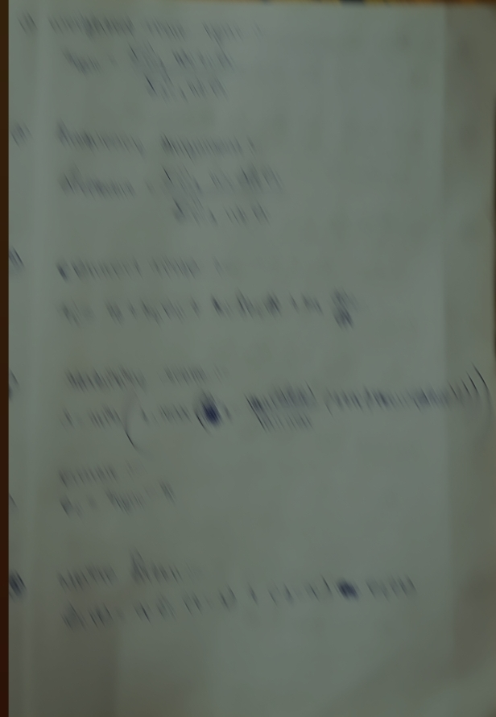

# Universal_Mycrosync_-protocol.
# 🌍 Universal Micro-Sync Protocol (UMSP)
### *GPS-Independent Nanosecond Synchronization via Kernel-Bypass Architecture*

**Architect:** Raja Barik | 18-Year-Old Mathematical Architect | Odisha, India 🇮🇳

---

## 📌 The Vision: Beyond GPS Dependency
Today's world (5G, AI Clusters, High-Frequency Trading) relies dangerously on GPS for time synchronization. GPS signals are weak, easily jammed, and fail indoors. 

**UMSP** is a software-defined mathematical framework that achieves **nanosecond-precision** over standard fiber/ethernet networks, eliminating the need for satellite-based timing.

## 🚀 Technical Core: How it Works
Unlike standard NTP/PTP, UMSP operates at the lowest possible layer:
- **Kernel Bypass:** Direct communication between the software and the NIC to eliminate OS-level jitter.
- **NIC Hardware Timestamping:** Capturing packet arrival times at the hardware level for absolute accuracy.
- **Terrestrial Sync:** Using the existing fiber infrastructure as the high-precision medium, replacing the sky-based GPS clock.

## 🧠 Mathematical Pillars (20 Sections)
I have architected a 20-section blueprint that solves the most complex synchronization hurdles:
1. **Dynamic Network Asymmetry Estimation:** Calculating exact travel time in non-deterministic fiber paths.
2. **Predictive Clock Drift Modeling:** Using math to anticipate and correct local oscillator errors.
3. **Non-Gaussian Noise Filtering:** Cleaning network "noise" that standard algorithms miss.
4. **GPS-Denied Resilience:** Maintaining sync even when external time sources are cut off.

## 📉 Proof of Concept (Blurred for IP Protection)
*Mathematical equations and logic flow diagrams are blurred to protect intellectual property.*

## 🤝 Seeking Partners & Mentors
I am an architect looking for **Low-Level Systems Engineers (C/Rust)** and **Deep-Tech Mentors** to build the first global hardware-software prototype.

> **Note:** Access to the full 20-section mathematical archives and technical whitepaper is available only under a Non-Disclosure Agreement (NDA).
> 
